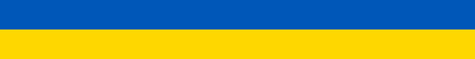

</img>

> __Save lives in Ukraine!__ __Donate to__ [__Come Back Alive__](https://savelife.in.ua/en/)

### About me

For me, coding is the way of describing intension to get things done, and I like to describe these intentions so they would be reasonable for both humans and machines.

My very first big project was to automate data processing and report preparation for a bachelor's degree in Material Science. I wanted to automate because some parts were iterative processes, and some just tiresome. For this task, I was looking for tools and revealed for myself the Python ecosystem for data analysis and LaTeX for high-quality typesetting. It was exciting to build such a complex pipeline, so I continued to learn how to work with real-world data using programming approaches.

This excitement led me to the web field. I implemented an eye-tracking library running directly in the browser using bleeding-edge tools from the Rust ecosystem for WebAssembly. It's oddly satisfying to see complex image processing pipeline is working on the simple web-page.

Today I find myself as a specialist who can solve machine learning problems, design web applications, and deliver code to a production environment.

In my free time, I like to play computer games and read science-fiction books. Also, I try to keep pace in becoming a better programmer by reading related textbooks and exploring modern technologies.

<!--  -->
